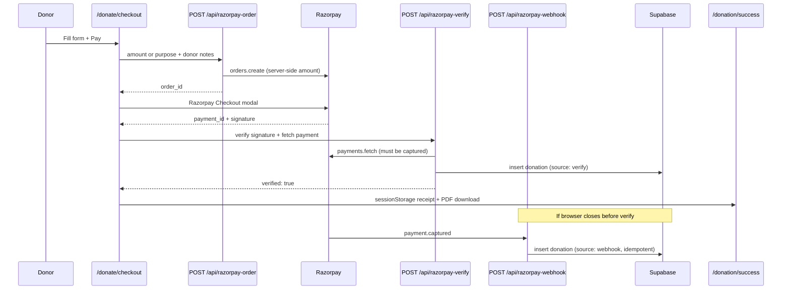

# Payments: ALLOWED_ORIGINS + Razorpay webhook (Vercel)

## 1. ALLOWED_ORIGINS (Vercel)

Blocks other websites from calling your donation APIs in production.

### Production

Vercel → Project → **Settings** → **Environment Variables** → **Production**:

| Name | Value |
|------|--------|
| `ALLOWED_ORIGINS` | `https://www.aadarfoundation.org,https://aadarfoundation.org` |

- No spaces after commas (or spaces are trimmed).
- No trailing `/` on URLs.
- Mark as **Sensitive** optional (not a secret, but hides from teammates).

### Preview (optional)

Same variable for **Preview**, or add your staging domain:

`https://www.aadarfoundation.org,https://aadarfoundation.org`

Vercel **preview** deploys also auto-allow `https://<your-preview-host>.vercel.app` when `VERCEL_URL` is set.

### Local dev

Leave `ALLOWED_ORIGINS` **unset** in `.env` (all origins allowed), **or** set:

`ALLOWED_ORIGINS=http://localhost:3000,http://127.0.0.1:3000`

Redeploy after changing Production variables.

---

## 2. Razorpay webhook

Backup path: saves donations to Supabase if the browser never hits `/api/razorpay-verify`.

### Razorpay Dashboard

1. **Settings** → **Webhooks** → **+ New Webhook**
2. **Webhook URL:** `https://www.aadarfoundation.org/api/razorpay-webhook`
3. **Events:** enable at minimum:
   - **`payment.captured`** (required — saves verified donations)
   - **`payment.failed`** (updates Supabase status)
   - **`refund.created`** and **`refund.processed`** (marks donations refunded)
   - Optional: **`payment.dispute.created`** (marks disputes)
4. **Active** → Save
5. Copy **Webhook Secret** (shown once)

Use **Test mode** webhook + test secret while testing; create a separate **Live mode** webhook before real donations.

### Vercel

| Name | Environment | Notes |
|------|-------------|--------|
| `RAZORPAY_WEBHOOK_SECRET` | Production (+ Preview if testing) | Paste secret from Razorpay — **Sensitive** |

Also ensure Production has live Razorpay keys (`RAZORPAY_KEY_ID`, `RAZORPAY_KEY_SECRET`, `REACT_APP_RAZORPAY_KEY_ID`) and Supabase vars.

**Redeploy** after adding the secret.

### Test webhook

Razorpay → Webhooks → your webhook → **Send test webhook** (`payment.captured`).

- **200** = signature OK
- **400 Invalid webhook signature** = wrong secret or redeploy needed
- **500 Webhook not configured** = missing `RAZORPAY_WEBHOOK_SECRET` on Vercel

Check Supabase `donations` for `source: webhook` on real captured payments.

---

## 3. Quick checklist

- [ ] `ALLOWED_ORIGINS` on Vercel **Production**
- [ ] `RAZORPAY_WEBHOOK_SECRET` on Vercel **Production**
- [ ] Webhook URL in Razorpay (live mode for live site)
- [ ] Redeploy
- [ ] Test donation on live site → row in Supabase (`source: verify`)
- [ ] Optional: Razorpay test webhook → 200 response

---

## 4. Supabase (required for donation log)

Without these on Vercel **Production**, payments still appear in Razorpay but **no row** is written to Supabase:

| Name | Notes |
|------|--------|
| `SUPABASE_URL` | Project URL from Supabase → Settings → API |
| `SUPABASE_SERVICE_ROLE_KEY` | **service_role** key (server only — never expose to React) |

1. In Supabase → **SQL Editor**, run `supabase/donations.sql` once.
2. Add both variables in Vercel → **Redeploy**.
3. `GET https://www.aadarfoundation.org/api/health` should show `"donation_store": true` under `integrations`.

After a test payment, check **Vercel → Logs** for `[donation]` or `[razorpay-verify]` if the row is missing.

---

## 5. Health check

`GET /api/health` returns safe flags (no secrets):

```json
"integrations": {
  "donation_store": true,
  "razorpay_webhook": true,
  "razorpay_server_keys": true
}
```

If `donation_store` is **false**, set Supabase env vars and redeploy. If `razorpay_webhook` is **false**, webhook backup saves will not run.

Locally: `http://localhost:3001/api/health` also shows `allowed_origins` details when not in production.

---

## 6. End-to-end payment flow (how it works)



**Security already in place:**

| Layer | What it does |
|-------|----------------|
| `ALLOWED_ORIGINS` | Blocks other sites from calling order/verify APIs |
| Server-side amounts | `purpose` → fixed `PROGRAMS` prices; custom amounts validated min/max |
| Checkout signature | HMAC `order_id\|payment_id` verified with `RAZORPAY_KEY_SECRET` |
| Capture check | Server fetches payment from Razorpay; must be `captured` and match order |
| Webhook signature | Raw body + `X-Razorpay-Signature` vs `RAZORPAY_WEBHOOK_SECRET` |
| Supabase | `service_role` only on server; RLS enabled, no public policies |
| Idempotency | `payment_id` unique — verify + webhook cannot duplicate rows |

**Receipts today:**

- After payment, donor sees `/donation/success` with on-screen receipt + **Download PDF** (English/Hindi).
- Receipt data is stored in **browser `sessionStorage`** for that tab/session only.
- Permanent copy is in **Supabase** (`donations` table) when env vars are set.
- Optional recovery API: `POST /api/donation-receipt` with `payment_id`, `donor_email`, `donor_pan` (must match Supabase row). UI for “retrieve receipt” can be added later.

---

## 7. Go live on Razorpay (checklist)

### A. Razorpay Dashboard (Live mode)

1. Complete **KYC / business activation** so Live mode is enabled.
2. **Settings → API Keys → Live** — generate **Live** Key ID + Secret.
3. **Settings → Webhooks** (while in **Live** mode):
   - URL: `https://www.aadarfoundation.org/api/razorpay-webhook`
   - Event: **`payment.captured`**
   - Copy **Webhook Secret** (shown once).
4. Ensure payments are set to **capture** (orders use `payment_capture: 1` in code).

### B. Vercel → Production environment variables

| Variable | Value |
|----------|--------|
| `REACT_APP_RAZORPAY_KEY_ID` | `rzp_live_...` (same as below) |
| `RAZORPAY_KEY_ID` | `rzp_live_...` |
| `RAZORPAY_KEY_SECRET` | Live secret (Sensitive) |
| `RAZORPAY_WEBHOOK_SECRET` | From Live webhook (Sensitive) |
| `SUPABASE_URL` | Project URL |
| `SUPABASE_SERVICE_ROLE_KEY` | service_role key (Sensitive, server only) |
| `ALLOWED_ORIGINS` | `https://www.aadarfoundation.org,https://aadarfoundation.org` |

**Critical:** `REACT_APP_RAZORPAY_KEY_ID` and `RAZORPAY_KEY_ID` must be the **same mode** (both live). The checkout page detects a mismatch and blocks payment.

Redeploy after changing any variable.

### C. Supabase

1. Run `supabase/donations.sql` in SQL Editor (new projects).
2. If the table already exists, also run:
   ```sql
   alter table public.donations add column if not exists receipt_no text;
   alter table public.donations add column if not exists donor_father_or_husband text;
   alter table public.donations add column if not exists fcra_declaration text;
   alter table public.donations add column if not exists donor_address text;
   alter table public.donations add column if not exists donor_state text;
   alter table public.donations add column if not exists donor_city text;
   alter table public.donations add column if not exists donor_pin text;
   alter table public.donations add column if not exists updated_at timestamptz not null default now();
   ```
3. Confirm `GET /api/health` → `"donation_store": true`.

### D. Production smoke test (real ₹1–₹10)

1. Open `https://www.aadarfoundation.org/donate/checkout` (or from Donate2 → Pay).
2. Complete a **small live** payment.
3. Confirm:
   - Success page + PDF download works.
   - Razorpay Dashboard → Payments shows **captured**.
   - Supabase `donations` row with `source: verify` (or `webhook` if verify failed).
4. Razorpay → Webhooks → send test `payment.captured` → expect **200**.

### E. Not built yet (optional improvements)

- Email receipt to donor (needs SendGrid/Resend + template).
- Admin dashboard to list/export donations (Supabase Studio works for now).
- Public “Retrieve my receipt” page wired to `POST /api/donation-receipt`.
- `payment.failed` webhook logging (updates existing Supabase rows to `failed`).
- Refund / dispute webhooks update Supabase status to `refunded` or `disputed`.
